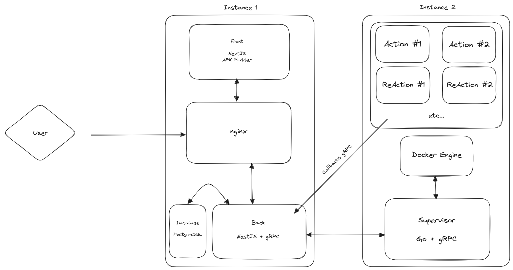

# Supervisor

The supervisor is a program whose main task is to launch jobs in a separate environment from the production.
It uses `gRPC` to communicate with the backend. The supervisor is written in `Golang`.

Let's take the following schema to understand the role of the supervisor:

The supervisor role is to orchestrate the execution of jobs. It receives gRPC requests from the backend and executes the jobs with the passed parameters.

The job parameters are passed using the command arguments of the container.

Workers communicate directly with the backend to send data and errors.

## Requirements 

The supervisor runs in a **Docker container** and is connected to the **Docker Engine API**, allowing it to create and remove containers.
> :warn: As the supervisor is running in a Docker container, it needs the access of the Docker Socket, which you need to mount in the container.

## Requests and responses

The supervisor communicates with the backend using gRPC. Declarations and prototypes are available on the side repository [area-proto](https://github.com/RezaRahemtola/area-proto)

The supervisor responds to the following requests:

### LaunchJob: Launch a job with the given parameters

The job parameters must have been checked before sending to the supervisor. 
The supervisor will inject some parameters in the job container:
- ``--identifier``: The unique identifier of the job
- ``--target``: URI of the backend

An error will be thrown if the job name is incorrect. 
If the job is already running, the supervisor won't do anything and return successfully. 

### KillJob: Stop a job with the given identifier

The supervisor will stop the job with the given identifier. 
If the job is not running, the supervisor won't do anything and return successfully. 

### KillAllJobs: Stop all running jobs

The supervisor will stop all running jobs. 

## Debug

The ``GO_ENV`` variable can be used to enable development or production mode.

The production mode removes automatically all docker containers when exited, while the development mode won't remove exited containers and add a count to the container name to avoid conflicts.

:warn: When the supervisor is launched, it will remove all containers previously launched by the supervisor.

## Jobs identification

To avoid creating several containers that will fetch the same data, each job has a unique identifier determined, by two factors:

- The uniqueness of a job
- The service and the type of data fetched
- The key parameters used in the job
- Format: "service-action-key_parameters"

For example, for a job that fetches the weather in Paris:

- The uniqueness of a job: If two people want to fetch the weather in Paris, the data will be the same
- The service and the type of data fetched: Every job that fetches weather data will share the same Docker Image
- The key parameters used in the job: The city name is the key parameter used in the job

The unique identifier for this job will be: `weather-fetch-weather-Paris`

> :warn: Reaction jobs cannot be grouped as their purpose is to execute and action and exit right after. 
